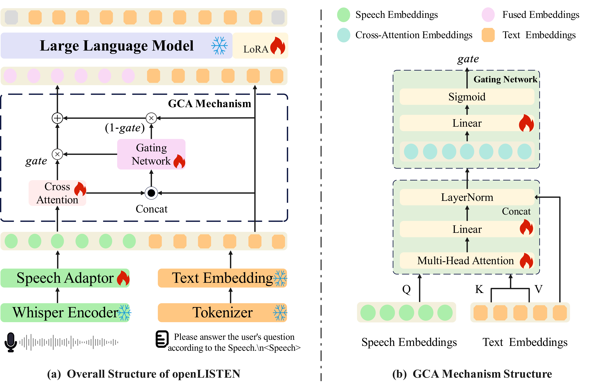

# openLISTEN: Freestyle Cross-Modal Instruction Compliance for Large Speech-Language Models with Limited Resources

[ACL Under Review] Official PyTorch implementation of the paper "openLISTEN: Freestyle Cross-Modal Instruction Compliance for Large Speech-Language Models with Limited Resources"

## Abstract

Recent advancements in Large Language Models (LLMs) have revolutionized text comprehension, yet bridging the gap to speech-native understanding remains a challenge due to the loss of paralinguistic features in cascaded systems and the high computational costs of end-to-end vocabulary expansion. To address these limitations, we propose \textit{openLISTEN}, a resource-efficient Large Speech-Language Model (LSLM) trained entirely on consumer-grade GPUs. By employing a Gated Cross-Attention (GCA) mechanism alongside an Open-Domain Cross-Modal Instruction Tuning strategy, openLISTEN achieves robust cross-modal alignment using only over 500 hours text-audio pairs. Extensive evaluations on URO-Bench demonstrate that openLISTEN achieves competitive performance compared to state-of-the-art(SOTA) baselines despite significantly fewer parameters. Furthermore, empirical results on cross-modal instruction compliance benchmarks indicate that our approach effectively mitigates the rigid response patterns and modality bias typically exacerbated by limited training data, thereby significantly enhancing instruction adherence and generalization in open-domain scenarios.

## Dataset

The **Open-Domain Cross-Modal Instruction Tuning** datasets are currently being organized. We will release them on Hugging Face with an academic application process. Please stay tuned! Note that the datasets will be available for academic research purposes only and cannot be used for commercial applications.
