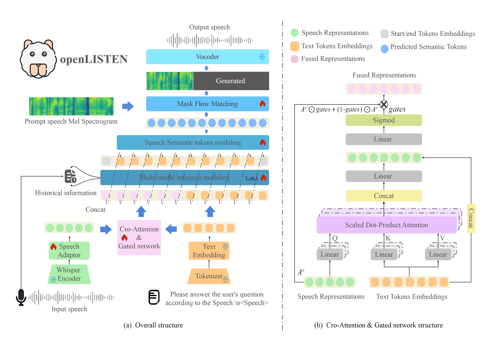

# openLISTEN: Freestyle Cross-Modal Instruction Compliance for Large Speech-Language Models with Limited Resources

[ACM MM 2025 Under Review] Official PyTorch implementation of the paper "openLISTEN: Freestyle Cross-Modal Instruction Compliance for Large Speech-Language Models with Limited Resources"
## Abstract


<p align="left">Recently, end-to-end large speech-language models (LSLMs) have advanced rapidly. These unified architectures directly map speech input to speech output, seamlessly integrating semantic and linguistic understanding without relying on intermediate handcrafted components. This enables direct and real-time speech interaction, thereby significantly enhancing user experience. However, current LSLMs still face notable challenges: They suffer from weak compliance with open-domain instructions due to poor cross-modal alignment, offer limited controllability over generated speech, and demand substantial computational resources. To address these limitations, we present a novel and lightweight open-source end-to-end LSLM framework, namely openLISTEN. It incorporates a gated cross-attention mechanism that effectively aligns speech and text representations via an open-domain instruction tuning strategy. Notably, openLISTEN can be trained using only four consumer-grade GPUs (i.e., GeForce RTX 4090D), making it highly accessible for academic research under low-resource conditions. Experimental results show that openLISTEN achieves competitive performance compared to recent state-of-the-art models across comprehensive benchmarks, despite using a smaller model size, significantly less training data, and reduced computational overhead.
</p>


<div align="center"></div>


## Getting Started

1. Install Package
```Shell
Look forward to it
```

2.Dataset
The QA datasets are still being collated and will be published when they are finished

3.Code
After the review, it will be made public
